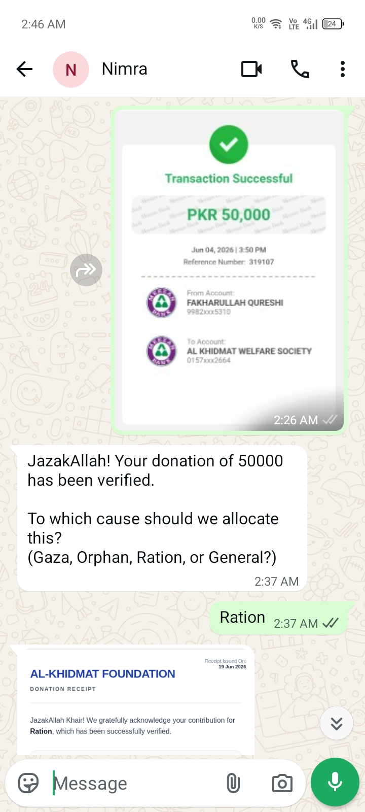
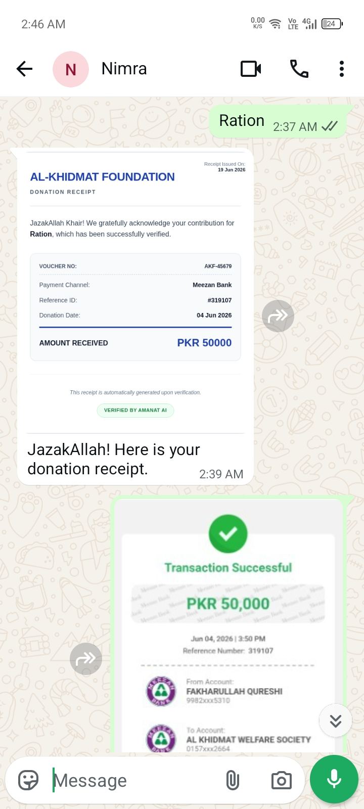
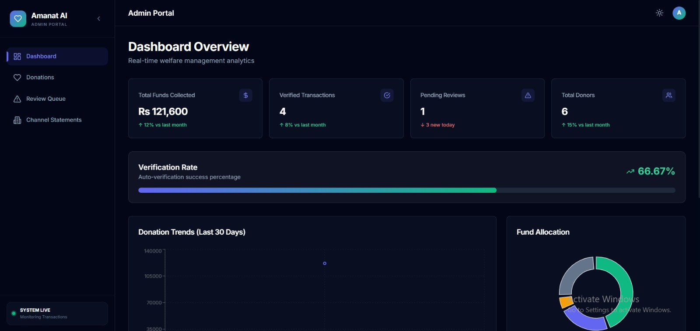
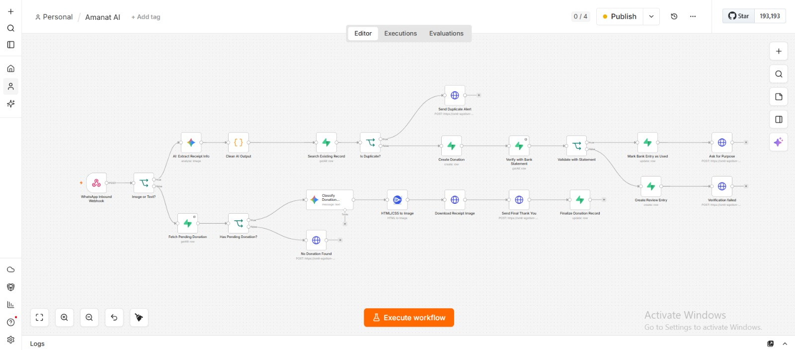
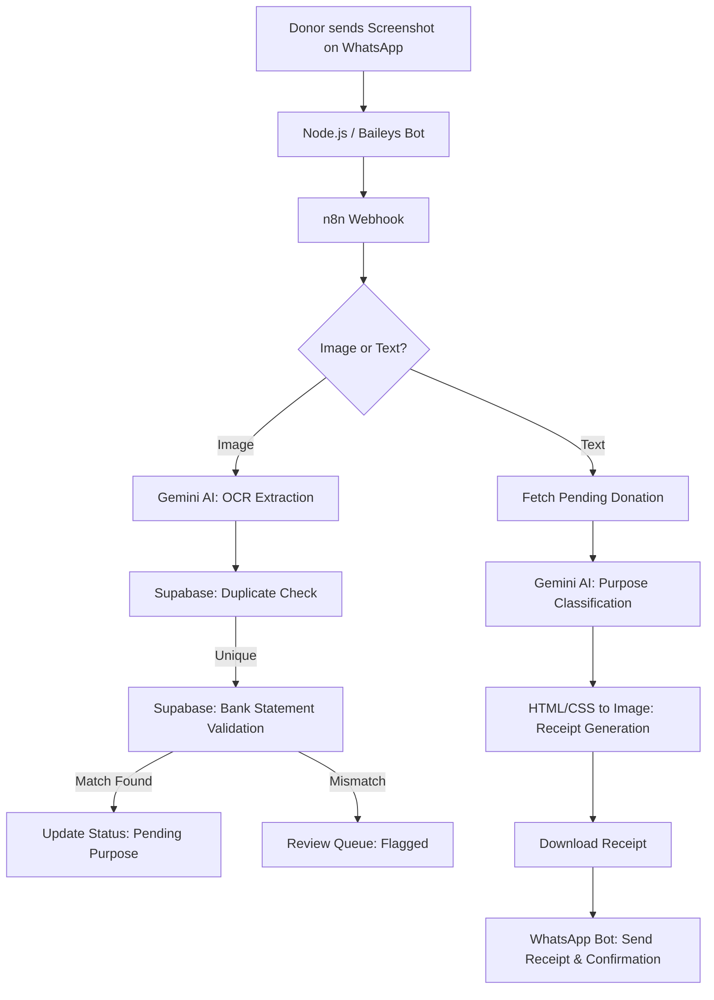

# Amanat AI - Automated Donation Verification & Purpose Routing 

> **Built for:** Build with AI Hackathon 2026 (GDG Kolachi)  
> **Problem Statement:** #7 (Al-Khidmat Foundation)

**Amanat AI** is an intelligent automation system designed to solve the massive manual bottleneck in charity donation processing. It automates the verification of bank transfer screenshots sent via WhatsApp, cross-references them with official bank statements in real-time, and routes funds to specific welfare projects using AI.

---

## Project Showcase

### WhatsApp Interface (Donor Side)
| Verification & Purpose Mapping | Official Digital Receipt |
| :---: | :---: |
|  |  |

### Admin Portal (Management Side)
 

### The Automation Engine (n8n Workflow)
| Full Backend Workflow Pipeline |
| :---: |
|  |

---

## The Problem
NGOs like **Al-Khidmat Foundation** receive thousands of donations monthly via direct bank transfers (HBL, EasyPaisa). Donors send payment screenshots on WhatsApp for attribution, creating a massive manual nightmare:

*   **Manual Data Entry:** Reading Ref IDs and amounts from blurry or low-res images.
*   **Verification Lag:** Cross-checking every entry against periodic bank statements to prevent fraud.
*   **Purpose Identification:** Manually chatting with donors to ask if the money is for **Gaza, Zakat, or Orphans**.
*   **Receipt Issuance:** Manually generating and sending acknowledgment receipts.

> **Amanat AI turns this hour-long manual process into a 10-second automated flow.**

---

## Solution
I built a seamless end-to-end pipeline using **n8n** for orchestration and **Google Gemini** for AI processing:

*   **Intelligent OCR:** Automatically extracts Transaction ID, Amount, Bank Name, and Time from diverse Pakistani banking screenshots (HBL, Meezan, SadaPay, EasyPaisa, etc.).
*   **Official Reconciliation:** Automatically cross-references extracted data with the **Actual Bank Statement** stored in **Supabase**.
*   **Conversational Intent:** An LLM understands donor replies in **Urdu, Roman Urdu, or English** (e.g., *"Yateem bacho ke liye"* or *"Gaza ke liye hai"*) and maps them to the correct project.
*   **Dynamic Official Receipts:** Generates a branded, high-quality digital receipt featuring the donor's **official bank-registered name** and sends it back instantly.
*   **Admin Transparency:** A centralized **Admin Dashboard** with a **'Review Queue'** to handle flagged or mismatched transactions.

---

## How It Works



## Tech Stack

*   **Workflow Automation:** [n8n](https://n8n.io/)
*   **Database:** [Supabase](https://supabase.com/) (PostgreSQL)
*   **AI/LLM:** Google Gemini (OCR & Intent Mapping)
*   **WhatsApp Interface:** Node.js + [@whiskeysockets/baileys](https://github.com/WhiskeySockets/Baileys)
*   **Receipt Rendering:** HTML/CSS to Image API
*   **Frontend:** Next.js & Tailwind CSS (Admin Portal)

---

## Database Schema (Supabase)

The system relies on three synchronized tables to manage the lifecycle of a donation:
1.  **`bank_statements`**: The source of truth containing official records from the bank.
2.  **`donations`**: Live tracking of donor submissions, extracted metadata, and verification status.
3.  **`review_queue`**: Exception handling table for flagged, mismatched, or blurry screenshots.

---

## Setup & Installation

Follow these steps to get the system running locally:

### 1. Database Setup (Supabase)
*   Create a new project on [Supabase](https://supabase.com/).
*   Run the provided SQL scripts (found in the `/database` folder) to create the necessary tables.
*   Note down your **Project URL** and **Service Role Key** for n8n and Frontend.

### 2. Workflow Setup (n8n)
*   Open your n8n instance and **Import** the `n8n-workflow.json` file.
*   Configure the following credentials:
    *   **Google Gemini API:** Obtain a key from [Google AI Studio](https://aistudio.google.com/).
    *   **Supabase API:** Add your URL and Service Role Key.
    *   **HTTP Request:** Setup credentials for the HTML/CSS to Image API.
*   Copy the **Production Webhook URL** from the n8n Webhook node.

### 3. WhatsApp Bot Setup
*   Navigate to the bot folder and install dependencies:
    ```bash
    cd whatsapp-bot
    npm install
    ```
*   Create a `.env` file in the same folder:
    ```env
    N8N_WEBHOOK=your_n8n_production_webhook_url
    PORT=3000
    ```
*   Run the bot:
    ```bash
    node server.js
    ```
*   **Scan the QR Code** in your terminal using WhatsApp "Linked Devices".

### 4. Admin Dashboard Setup (Frontend)
*   Navigate to the frontend folder:
    ```bash
    cd dashboard
    npm install
    ```
*   Create a `.env.local` file and add:
    ```env
    NEXT_PUBLIC_SUPABASE_URL=your_supabase_url
    NEXT_PUBLIC_SUPABASE_ANON_KEY=your_supabase_anon_key
    ```
*   Start the development server:
    ```bash
    npm run dev
    ```

